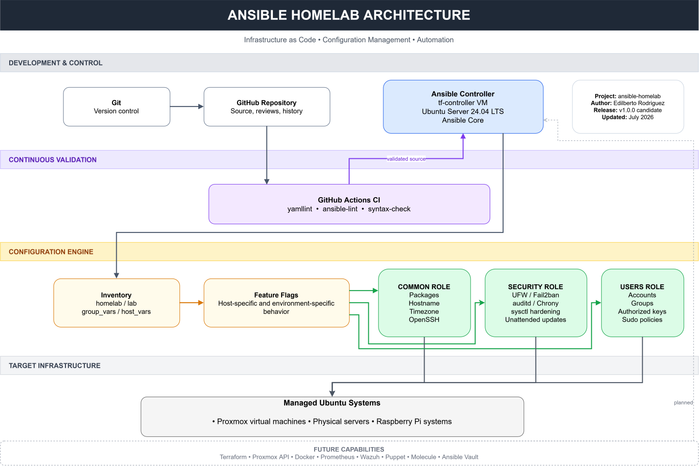

# Ansible Homelab

[](https://github.com/edilbertorodriguez/ansible-homelab/actions/workflows/ansible-ci.yml)

Production-inspired Infrastructure as Code (IaC) project built with **Ansible** to automate Linux systems administration, security hardening, and home lab infrastructure using modern Systems Engineering and DevOps practices.

This repository serves as my personal automation framework for managing my home lab while demonstrating production-quality Ansible development practices.

---

# Architecture

The diagram below illustrates the end-to-end automation workflow implemented by this repository, from source control and continuous integration through configuration management and deployment to managed Ubuntu systems.



For additional implementation details, see the [Architecture Documentation](docs/architecture.md).

---

# Project Goals

- Develop reusable and idempotent Ansible roles.
- Standardize Linux server configuration across multiple hosts.
- Automate systems administration tasks.
- Apply infrastructure security best practices.
- Demonstrate Infrastructure as Code (IaC) methodologies.
- Build a maintainable automation framework suitable for enterprise environments.
- Integrate with Terraform, Proxmox, and monitoring platforms.

---

# Current Technologies

## Implemented

- Ansible Core
- Ubuntu Server 24.04 LTS
- Git
- GitHub
- GitHub Actions
- YAML
- Jinja2 Templates
- OpenSSH
- Proxmox VE
- UFW
- Fail2ban
- auditd
- Chrony
- Linux Kernel hardening (sysctl)

## Planned

- Terraform
- Puppet
- Docker
- Prometheus Node Exporter
- Wazuh Agent
- Tailscale
- Molecule
- Ansible Vault

---

# Current Features

## Common Role

- Linux bootstrap automation
- Baseline package management
- Hostname management
- Timezone management
- OpenSSH daemon management
- SSH configuration validation
- Handler-based service management
- Host-specific feature flags
- Idempotent configuration management

## Security Role

- Security package installation
- Unattended security updates
- Fail2ban configuration
- Linux Audit Framework (auditd)
- Chrony time synchronization
- Kernel hardening using sysctl
- UFW firewall management
- Inventory-driven firewall rules
- Feature flag support
- Idempotent security configuration

## Users Role

- Local Linux user management
- Linux group management
- SSH authorized key deployment
- Sudo policy management
- Inventory-driven user definitions
- Validation and idempotent execution

## Code Quality

- GitHub Actions CI
- ansible-lint (Production Profile)
- yamllint
- Ansible syntax validation
- Repeatable idempotency testing

---

# Design Principles

This project follows several engineering principles used in professional infrastructure environments:

- Infrastructure as Code (IaC)
- Idempotent automation
- Modular role architecture
- Feature flag driven deployments
- Vendor-supported configuration management
- Configuration validation before service restart
- Minimal external dependencies
- Incremental deployment strategy
- Reusable role design

---

# Repository Structure

```text
ansible-homelab/
├── .github/
│   └── workflows/
│       └── ansible-ci.yml
├── docs/
│   ├── architecture.drawio
│   ├── architecture.md
│   ├── architecture.svg
│   ├── inventory.md
│   ├── roles/
│   └── testing.md
├── inventories/
│   ├── homelab/
│   └── lab/
├── playbooks/
│   ├── bootstrap.yml
│   ├── bootstrap-ubuntu.yml
│   ├── infrastructure.yml
│   ├── monitoring.yml
│   ├── security.yml
│   └── updates.yml
├── roles/
│   ├── common/
│   │   ├── defaults/
│   │   ├── handlers/
│   │   ├── tasks/
│   │   └── templates/
│   ├── security/
│   │   ├── defaults/
│   │   ├── handlers/
│   │   ├── tasks/
│   │   └── templates/
│   └── users/
│       ├── defaults/
│       └── tasks/
├── ansible.cfg
├── LICENSE
├── README.md
└── site.yml
```

---

# Testing and Validation

Every change introduced into this repository is validated through multiple quality gates.

### Static Validation

- YAML syntax validation
- ansible-lint (Production Profile)
- Ansible syntax checks

### Functional Validation

- Idempotency verification (`changed=0`)
- SSH configuration validation (`sshd -t`)
- Manual deployment testing against lab infrastructure

### Continuous Integration

Every push automatically executes GitHub Actions to verify repository integrity before changes are accepted.

---

# Roadmap

## Completed

- Linux bootstrap automation
- Common role
- Users role
- Security role
- Package management
- Hostname management
- Timezone management
- OpenSSH daemon management
- SSH configuration validation
- Local user management
- Linux group management
- SSH authorized key deployment
- Sudo policy management
- Unattended security updates
- Fail2ban configuration
- Linux Audit Framework (auditd)
- Chrony time synchronization
- Linux kernel hardening (sysctl)
- UFW firewall management
- GitHub Actions CI

## In Progress

- Documentation refinement
- Repository polish

## Planned

- Docker role
- Prometheus Node Exporter
- Wazuh Agent
- Proxmox automation
- Terraform integration
- Puppet integration
- Molecule testing
- Secrets management using Ansible Vault

---

# Future Repository Ecosystem

This repository is part of a broader Infrastructure Engineering and Cybersecurity portfolio.

| Repository | Focus | Status |
|------------|-------|--------|
| `ansible-homelab` | Linux configuration management and security hardening | Active |
| `terraform-proxmox-lab` | Proxmox infrastructure provisioning | Planned |
| `monitoring-stack` | Prometheus, Node Exporter, and Grafana monitoring | Planned |
| `wazuh-lab` | Security monitoring and detection engineering | Planned |
| `kubernetes-homelab` | Container orchestration and service deployment | Planned |
| `puppet-homelab` | Continuous configuration enforcement | Planned |

Together, these projects are intended to demonstrate an end-to-end Infrastructure as Code workflow covering infrastructure provisioning, configuration management, observability, security monitoring, and continuous enforcement.

---

# About This Project

Although this repository is built around a home lab, the architecture and engineering practices intentionally mirror production environments.

The objective is to demonstrate practical experience with:

- Linux Systems Administration
- Infrastructure Automation
- Configuration Management
- Infrastructure as Code
- Security Hardening
- DevOps Engineering

---

# Author

**Edilberto Rodriguez**

Systems Administration • Infrastructure Engineering • Cybersecurity

GitHub:

https://github.com/edilbertorodriguez

---

# License

MIT License
